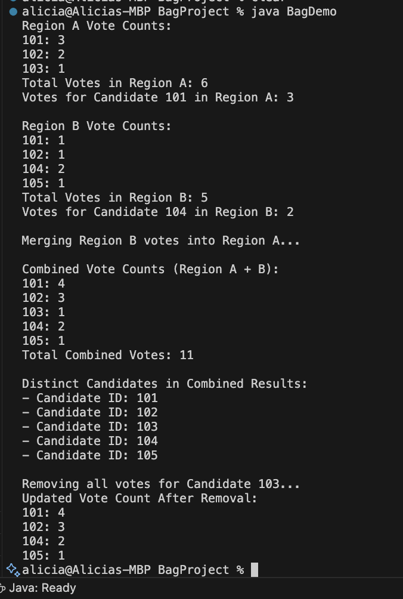

# Java Bag (Multiset) Implementation

This project implements a generic **Bag** data structure (also known as a **Multiset**) in Java. A bag is a collection that allows **duplicates** and stores **element frequencies**, unlike standard sets which do not.

The demo simulates a **vote counting system**, where each vote is represented by an integer (e.g., candidate ID). This shows how the bag can be used in real-world scenarios like tallying repeated values.

---

## Features

- Add elements to the bag
- Remove a single instance of an element
- Check if an element exists
- Count the number of times an element appears
- Display all elements with their counts
- Calculate total size including duplicates**
- Merge two bags into one**
- Get a new bag of only distinct elements**

---

## Example Scenario: Vote Counter

Candidate IDs are integers like `101`, `102`, etc. Multiple votes can be cast for the same candidate.

The program now also supports merging results from multiple regions and extracting the set of distinct candidates.

---

## How to Run

```bash
javac Bag.java BagDemo.java
java BagDemo
```

---

## Example Output

Sample program output after demonstrating all features:


